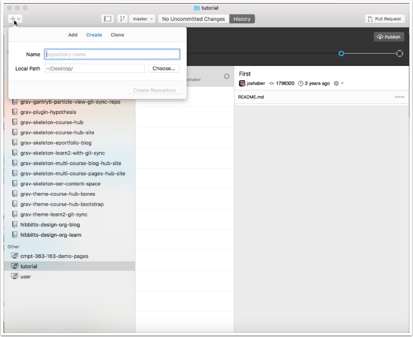
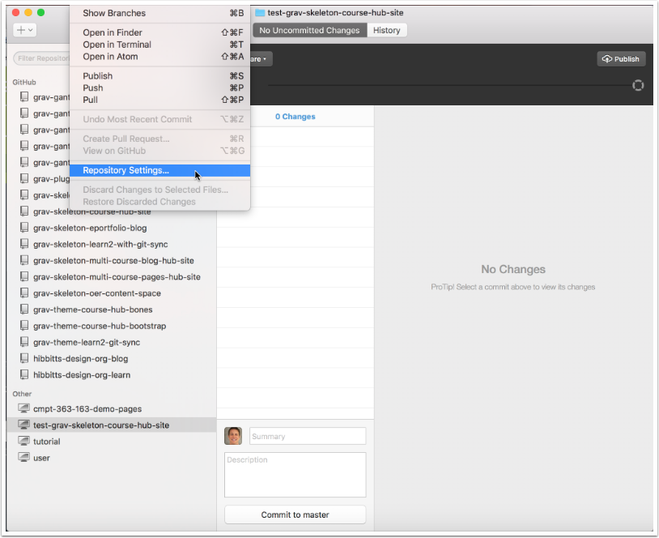
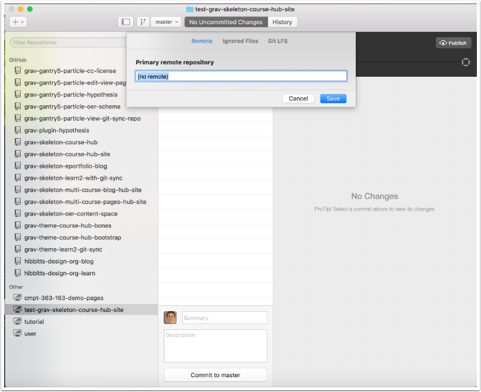
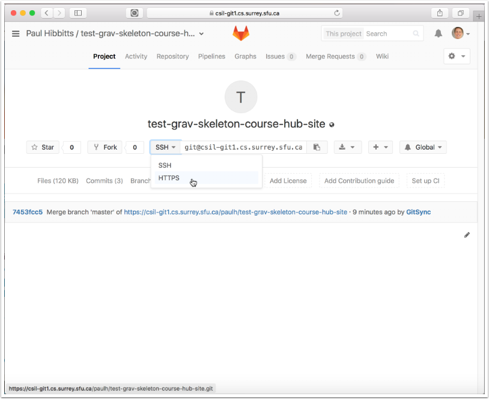
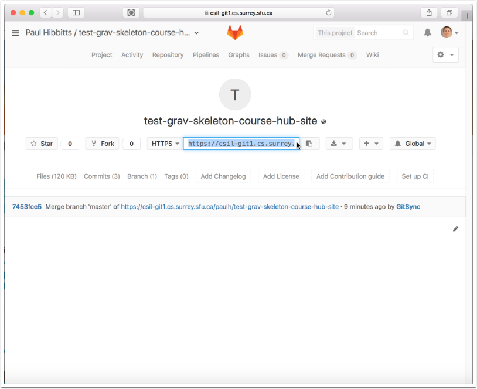
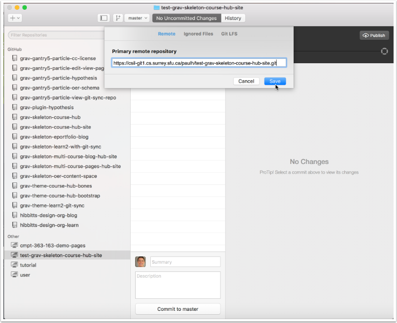
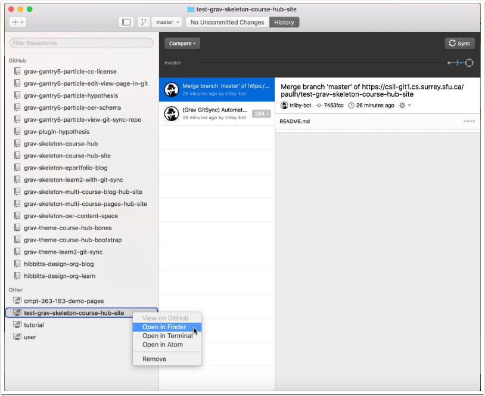
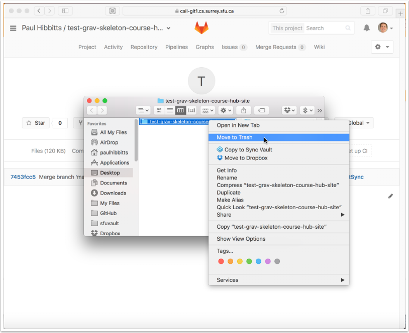
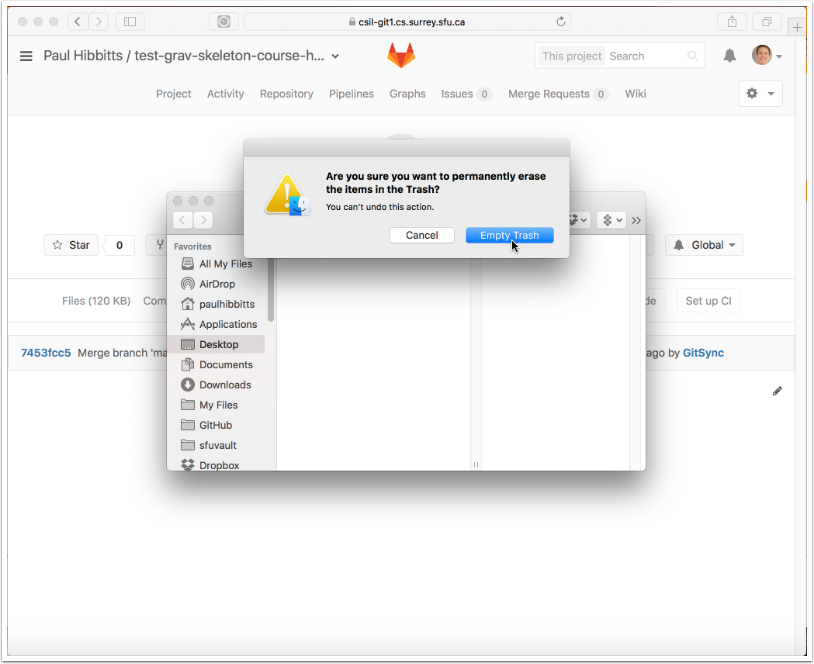
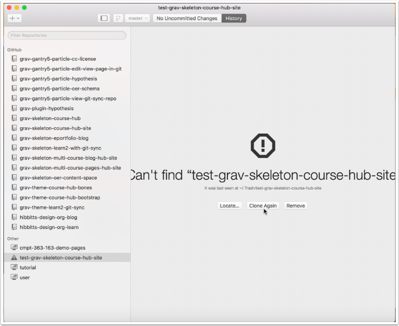

* [1. Create Local Repository](#1-create-local-repository)
* [2. Link Remote (GitLab) Repository](#2-link-remote-repository)
* [3. Quit GitHub Desktop](#3-quit-github-desktop)
* [4. Delete Local Repository Folder](#4-delete-local-repository-folder)
* [5. Launch GitHub Desktop](#5-launch-github-desktop)
* [6. Re-clone Repository](#6-re-clone-repository)

#### 1. Create Local Repository

##### 1.1 Tap on the "+" button in the upper-left of the GitHub Desktop window

##### 1.2 In the "Create" panel enter the name for your repository and tap the "Create Repository" button

#### 2. Link Remote Repository

##### 2.1 View the settings for your newly created repository

On Mac, tap the "Repository" menu and chose "Repository Settings...".

On Windows, tap on the gear icon in the upper-right of your GitHub Desktop window.

##### 2.2 With the "Remote" panel visible for your repository, open your Browser and sign into your GitLab account

##### 2.3 Go to your GitLab project (repository) and tap on "HTTPS" to view that address for the repository

##### 2.4 Copy the HTTPS address of your GitLab project repository

##### 2.5 Return to GitHub Desktop, paste the HTTPS address of your GitLab project into the "Primary remote repository" field and tap "Save"

##### 2.6 Right-tap the entry for your newly created local repository folder and view it's local folder

On Mac, choose "Open in Finder"

On Windows,  choose "Open in Explorer"

#### 3. Quit GitHub Desktop

On Mac, due to an issue with the current version of GitHub Desktop (v.222), you must re-launch and then quit the app once again before continuing.

#### 4. Delete Local Repository Folder

##### 4.1 Move the folder containing your local repository to the Trash/Recycling Bin

On Mac, right-tap the folder and choose "Move to Trash"

On Windows, right-tap the folder and choose "Delete"

##### 4.2 Permanently delete the repository folder from your Trash/Recycling Bin

On Mac, right-tap the Trash Can and choose "Empty Trash"

On Windows, right-tap the Recycling Bin and and choose "Empty Recycle Bin"

#### 5. Launch GitHub Desktop

#### 6. Re-clone Repository

##### 6.1 Tap the "Clone Again" button in GitHub Desktop

##### 6.2 Right-tap the entry for your newly created local repository folder and view it's local folder

On Mac, choose "Open in Finder"

On Windows,  choose "Open in Explorer"

##### 6.3 Review the files of your cloned GitLab repository

You can now edit these files locally, and use GitHub Desktop to push changes to your remote repository.

